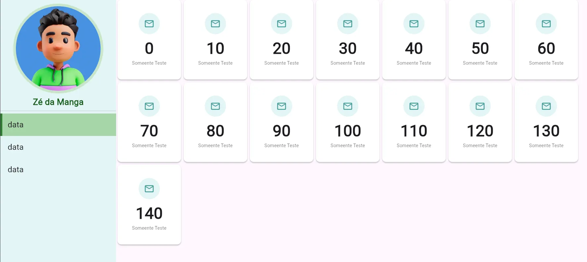

# 📱 Projeto Flutter: Dashboard de Exemplo

Este projeto foi desenvolvido como parte da disciplina **Programação de Dispositivos Móveis**, do curso de **Ciência da Computação**. O objetivo é **ensinar a construção de interfaces gráficas** com o framework **Flutter**, utilizando como exemplo a criação de um **dashboard interativo e responsivo**.

## 🎯 Objetivos do Projeto

- Apresentar os fundamentos do Flutter e Dart.
- Explorar a construção de telas com `Widgets`.
- Implementar layouts flexíveis usando `Row`, `Column`, `GridView`, `ListView` e `Stack`.
- Estimular boas práticas em organização de código e componentização.
- Demonstrar o uso de temas, navegação e responsividade.

## 🛠️ Tecnologias Utilizadas

- **Flutter 3.x**
- **Dart**
- **Android Studio** ou **Visual Studio Code** (IDE)
- **Material Design**
- (Opcional) Flutter DevTools para inspeção de layout

## 📸 Capturas de Tela

| Dashboard |
|-----------|
|  |

## 📂 Estrutura do Projeto

```bash
lib/
├── main.dart
├── app.dart
└── screens/
    └── home_page.dart
```

## 🚀 Como Executar

1. **Clone o repositório:**

```bash
git clone https://github.com/karlaycosta/app_dashborad.git
cd app_dashborad
```

2. **Instale as dependências:**

```bash
flutter pub get
```

3. **Execute o aplicativo:**

```bash
flutter run
```

> Você pode rodar em um emulador Android, dispositivo real ou iOS (se estiver em um Mac).

## 📚 Conteúdos Trabalhados

- Estrutura básica de um projeto Flutter
- Stateless vs Stateful Widgets
- Navegação entre telas (`Navigator`)
- Layout com `Container`, `Padding`, `Expanded`, `Flexible`
- Customização com `ThemeData`
- Criação de componentes reutilizáveis

## 👨‍🏫 Público-alvo

Estudantes da disciplina de **Programação de Dispositivos Móveis**, com conhecimentos prévios em lógica de programação e orientação a objetos.

## 💡 Sugestões de Extensões

- Conectar a um backend (Firebase, Supabase ou API REST)
- Adicionar animações com `AnimatedContainer` ou `Hero`
- Utilizar pacotes como `qr_flutter` para renderização de QR Code

## 📄 Licença

Este projeto está sob a licença MIT. Veja o arquivo [LICENSE](LICENSE) para mais detalhes.

---

Desenvolvido com 💙 para fins educacionais.
